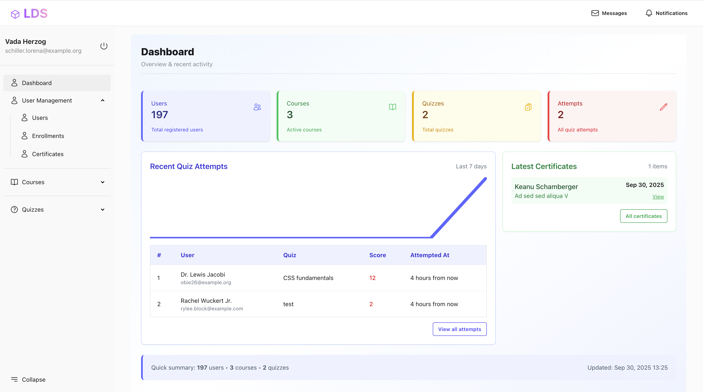

# Learn, Develop and Success (LDS) – An Integrated Online Code Learning Platform

## Project Abstract

**Learn, Develop and Success (LDS)** is an educational website designed to support learners of all ages who are interested in mastering the fundamentals of coding and programming. The platform offers a wide array of learning resources, including text-based and video-based tutorials, practical programming exercises, quizzes, certificates, and downloadable PDF guides. It caters to both beginners and experienced learners, covering popular programming languages such as Python, Java, JavaScript, C++, HTML, CSS, MySQL, PHP and so on.

LDS emphasizes hands-on learning, helping users develop practical coding skills and build real-world projects. The website is user-friendly, ensuring a smooth learning experience with easily accessible resources for every learner. Additionally, LDS aims to empower individuals with the coding proficiency necessary to thrive in today’s increasingly digital world. By offering structured and engaging content, the platform makes coding education approachable, interactive, and effective for learners at all stages.

---

## Features

- **Stats Cards:** Quick overview of users, courses, quizzes, and attempts.  
- **Recent Quiz Attempts:** Shows latest attempts with sparkline chart.  
- **Latest Certificates:** Displays recent certificates issued with links.  
- **Responsive Design:** Works on desktop and mobile devices.  
- **Interactive UI:** Hover effects, colored cards, badges, and buttons.  
- **Livewire Integration:** Dynamic updates without page reload.  

---

## Screenshots

### Dashboard Overview


---

## Installation

1. Clone the repository:

```bash
git clone https://github.com/yourusername/lds.git
cd lds
